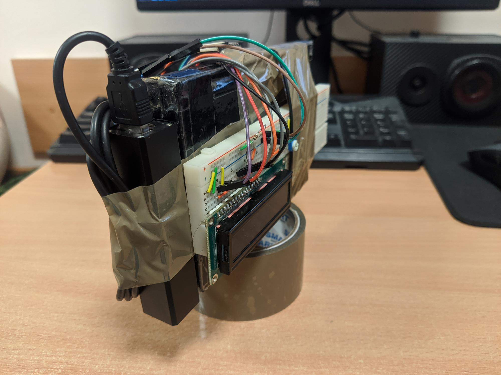

# NRF_BLE_HID_Controller

## Basic requirements:

#### Hardware:

  - Waveshare Bluetooth 4.0 NRF51822 Eval Kit
  - J-Link programmer
  - MPU6050 accelerometer module
  - HD44780 LCD
  - BLE compatible Windows PC
 
#### Software:
  - Windows 8+
  - Python 3 32-bit or LabVIEW 2018+
  - J-link programmer software
  
## Development requirements:

#### Embedded development:

  - mingw32
  - arm-gcc
  - Visual Studio Code with cortex-debug plugin
  
#### Windows app development:

  - Visual Studio 2019
  - Visual Studio C++ development tools
  - Windows Driver Kit 8+
  
## Docs:
* [Konspekt](docs/Konspekt.pdf)   
* Raport - #TODO

## Movie:

#TODO

## Images:

